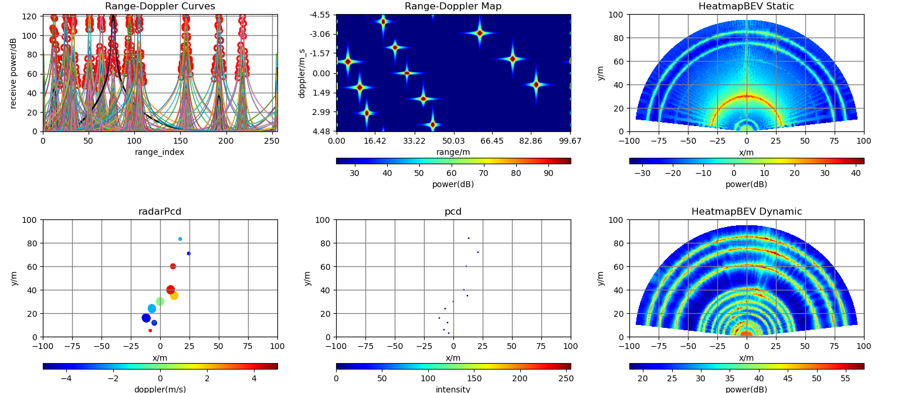
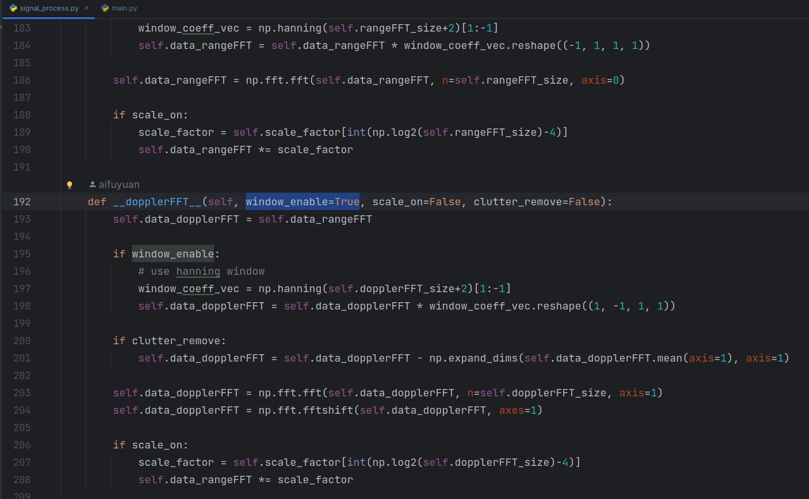
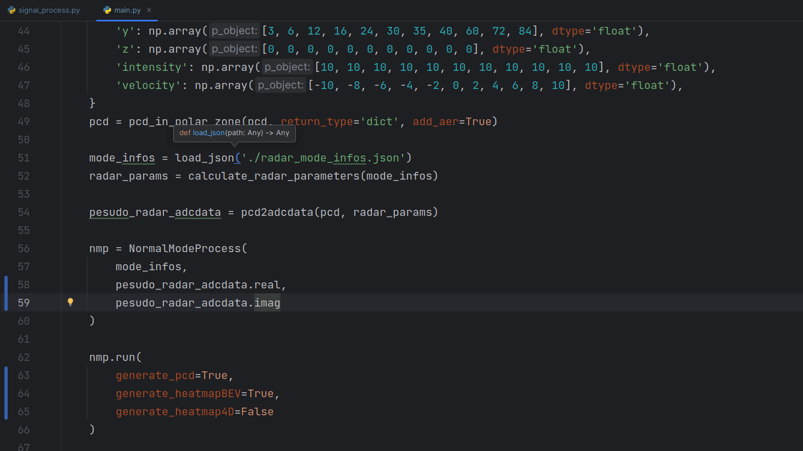
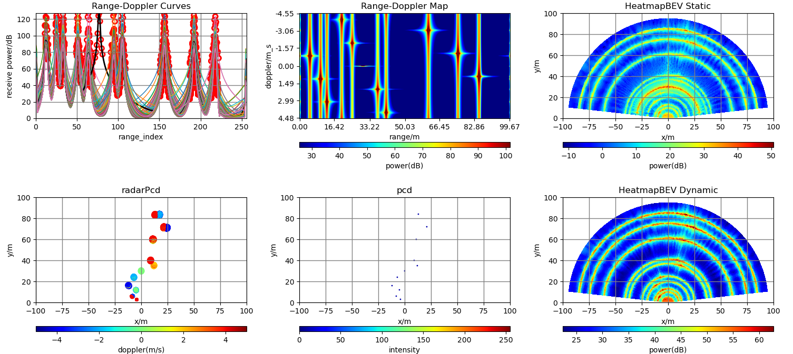
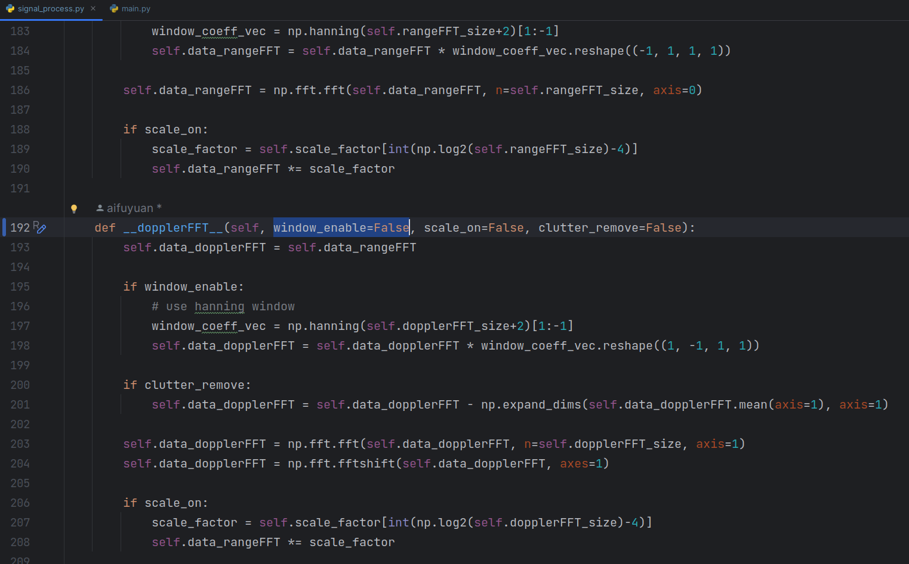
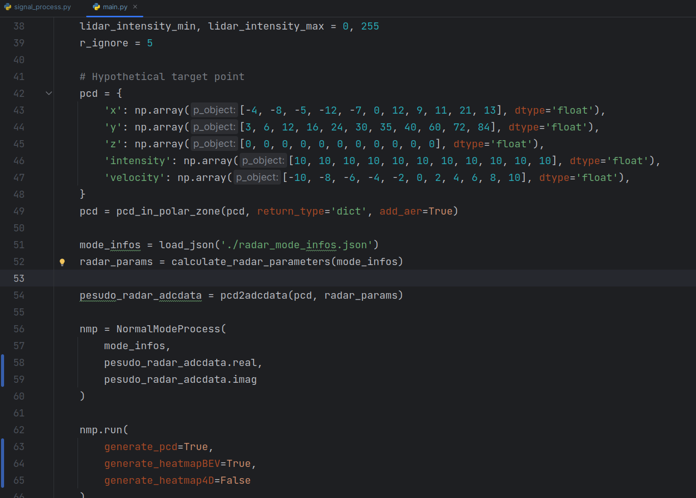
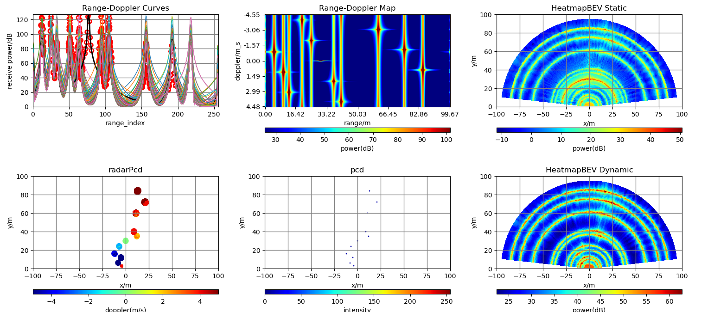
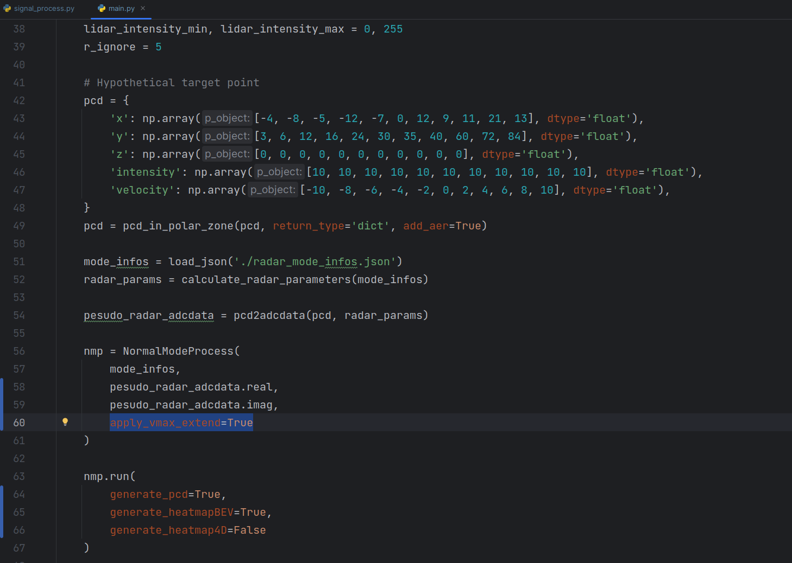

# mmwave radar pesudo adcdata

## case 1

当dopplerFFT环节开启hanning窗滤波，点云生成时，遗漏了最近的目标点

## case2

当dopplerFFT环节未开启hanning窗滤波，点云生成时，未遗漏目标点，但速度模糊现象愈发严重

## case3

当dopplerFFT环节未开启hanning窗滤波，开启速度扩展算法选项，点云生成时，未遗漏目标点，速度模糊现象有所缓解

